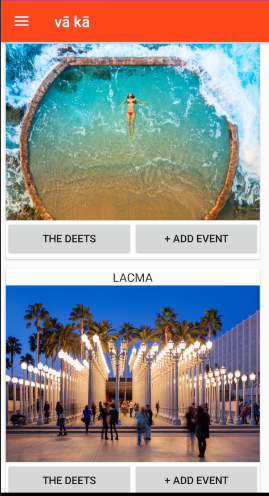
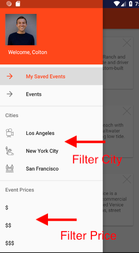
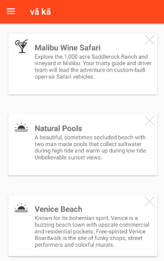

# vā kā Android
Q4 Project - learn a new language

## What are you looking at?
vā kā is your solution to easily browse and save events in major cities on the go.

## Technologies:
Front-end: Java, Android Studios, Volley-HTTP Client

## Technical Requirements:
### Frontend

- [x] Allow for users to be able to interact with the site.
- [x] Include some client-side validation.
- [x] Have your frontend interact with routes.
- [x] Have a separate project directory and GitHub repository for your frontend.

  
  

